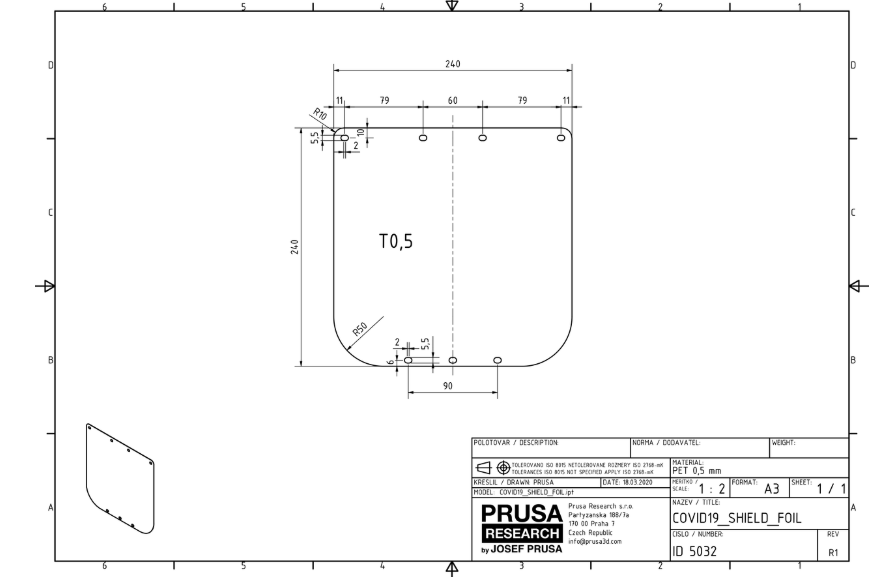

## Which tools do you need?

A 3D printer, a laser cutter, and scissors

## Which are the model files for 3d printing? 

All the model files can be found online [here](https://www.prusaprinters.org/prints/25857-protective-face-shield-rc1/files)

This repo has all the needed files on [the src local folder](../../src) and the [repo-link](https://github.com/CombatCovid/medical-shields-for-3d-printing/tree/master/src)

